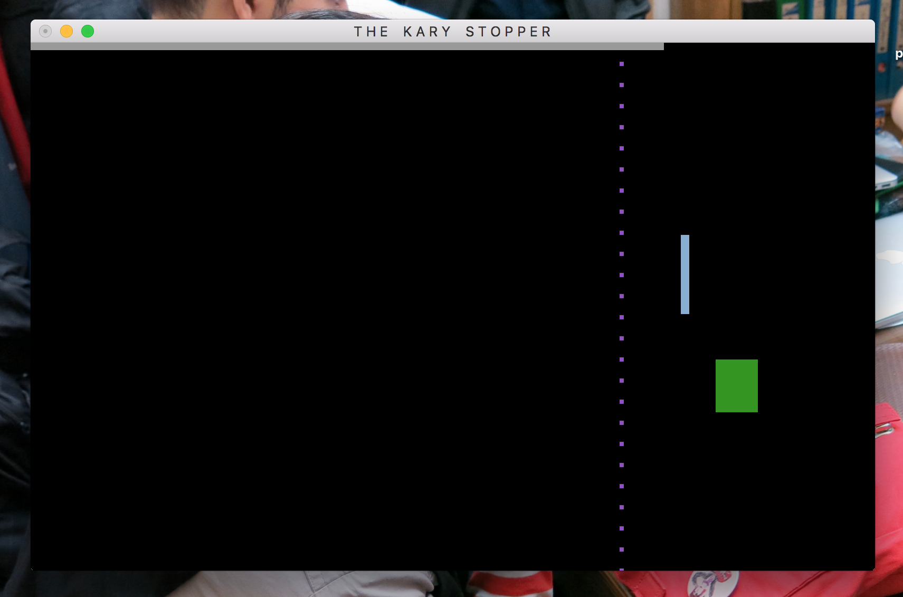

[](http://www.karyfoundation.org/developer/dead-repo/)

# Kary Stopper


It was to be a stupid little project for our Graphic 1 class, but well it seems I'm starting to like it! Its a funny game where you have to stop the green stuff coming to you and each time you don't you loose a life, after 4 life's you're all dead!

## License

```
Stopper - Stupid funny minimal game
Copyright (c) 2015 Pouya Kary <k@karyfoundation.org>


This program is free software: you can redistribute it and/or modify
it under the terms of the GNU General Public License as published by
the Free Software Foundation, either version 3 of the License, or
(at your option) any later version.

This program is distributed in the hope that it will be useful,
but WITHOUT ANY WARRANTY; without even the implied warranty of
MERCHANTABILITY or FITNESS FOR A PARTICULAR PURPOSE.  See the
GNU General Public License for more details.

You should have received a copy of the GNU General Public License
along with this program.  If not, see <http://www.gnu.org/licenses/>.
```
